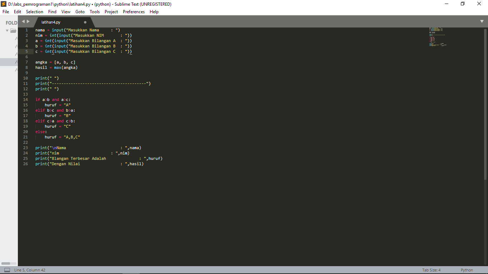
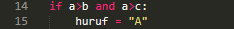
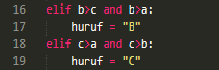
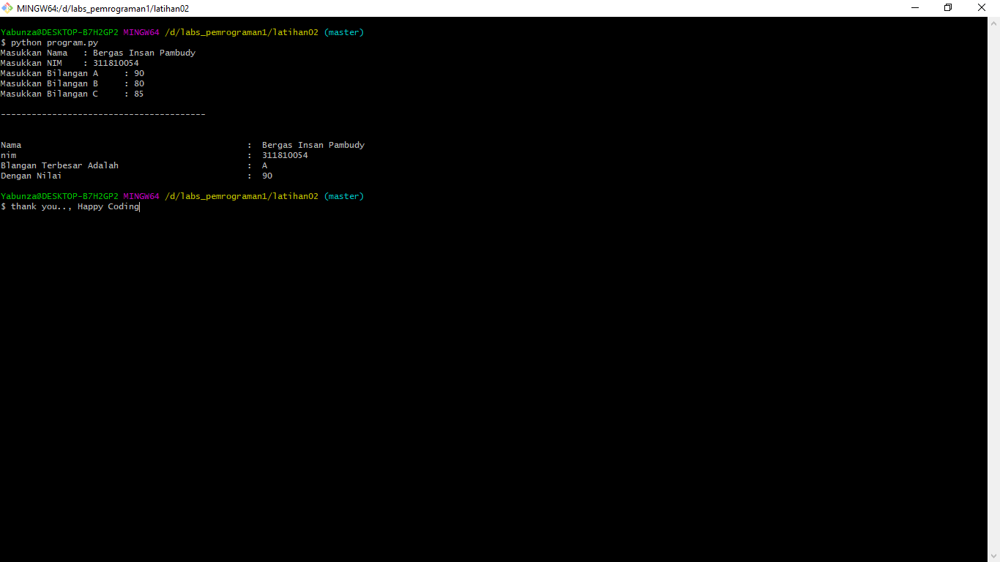

# Program Python 1
## Macam - Macam Kondisional di Python

- Ada tiga macam kondisional di Python, yang dapat Anda gunakan untuk membangun alur logika untuk program Anda. 
Python memiliki statement **if**, **if..else**, dan **if..elif..else**.

1. Seperti halnya bahasa pemrograman yang lain, bahasa python juga mempunyai percabangan berupa **if** yaitu bila suatu kondisi tertentu tercapa maka apa yang harus dilakukan. Dengan fungsi ini kita bisa menjalankan suatu perintah dalam kondisi tertentu.

Berikut ini adalah contoh penggunaan **if** di Python:

2. Bila kondisi yang akan didefinisikan cukup banyak, Anda dapat menambah kondisi lain dengan menggunakan **elif** di bawah statement **if** dan sebelum statement **else**:

Berikut adalah contoh penggunaan **elif** di dalam kondisional Python:

3. Untuk memeriksa kondisi yang tidak memenuhi kondisi utama. Maka **else** digunakan untk menangani semua kondisi selain kondisi yang telah dituliskan.

Berikut adalah contoh penggunaan **else** di Python:

- Hasil outputnya

## Operator Pembandingan

- Operator ini digunakan untuk membandingkan dua buah nilai. Operator ini juga dikenal dengan operator relasi dan sering digunakan untuk membuat sebuah logika atau kondisi.

Opertor ini terdiri dari:

| Operator|Simbol|
| ----------|------------|
| Lebih Besar|> |
| Lebih Kecil|< |
| Sama Dengan|== |
| Tidak Sama Dengan|!= |
| Lebih Besar Sama dengan|>= |
| Lebih Kecil Sama dengan|<= |

## Operator Logika

- Operator logika digunakan untuk membuat operasi logika, seperti logika AND, OR, dan NOT.

Operator logika terdiri dari:

| Nama| Simbol di Python |
|-----|-------------------|
| Logika AND|and |
| Logika OR|or |
| Negasi/Kebalikan|not |